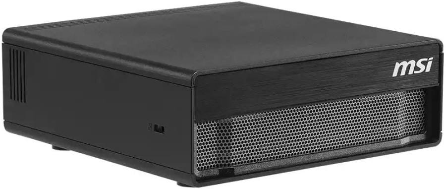
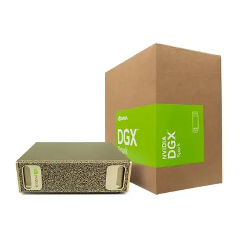
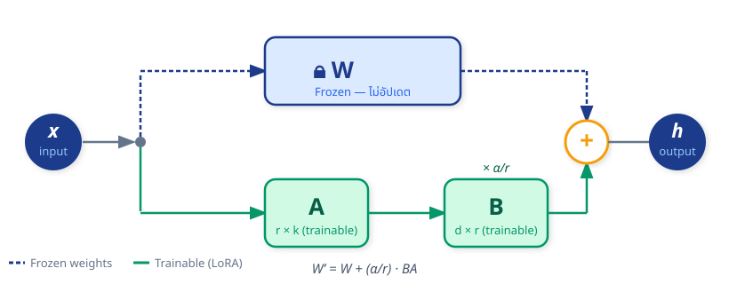

<!-- _class: lead -->
<!-- _paginate: false -->


<style scoped>
img[alt="Mahidol University"] { position: absolute; top: 40px; left: 70px; width: 120px; height: 120px; object-fit: contain; }
</style>


# Local LLM & Fine-Tuning
### Mini AI Agent Engineering
ผศ.ดร. ทวีศักดิ์ สมานชื่น
ITM | คณะวิศวกรรมศาสตร์ | มหาวิทยาลัยมหิดล
September 2026


---


## Agenda


1. Local LLM — ทำไมต้องรันโมเดลบนเครื่องเราเอง
2. Fine-tuning — ปรับโมเดลให้ตอบสนองตามความต้องการของเรา
3. Data Engineering — เตรียมข้อมูลให้เหมาะสมกับการฝึกโมเดล
4. Lab — ลงมือทำจริงบน Colab (QLoRA + Unsloth)
5. Evaluation & Deployment — ประเมินผลและนำไปใช้งานจริง


---

## 🛠️ สิ่งที่ต้องเตรียม (Prerequisites)

### ก่อนเข้าเวิร์กช็อป ควรเตรียมสิ่งต่อไปนี้ให้พร้อม

- **Google Account** — เปิด [colab.research.google.com](https://colab.research.google.com) แล้วตั้ง Runtime เป็น **GPU (T4)**
  - ไปที่ Runtime → Change runtime type → Hardware accelerator → **T4 GPU**
- **Hugging Face Account + Token** — สมัครที่ [huggingface.co](https://huggingface.co) แล้วสร้าง token ที่ Settings → Access Tokens (เลือกสิทธิ์ **Write**)
- **ชุดข้อมูลตัวอย่าง** — ไฟล์ `.jsonl` ประมาณ 50–100 ตัวอย่าง
    - ถ้ายังไม่มี สามารถใช้ dataset สาธารณะจาก Hugging Face ได้เลย เช่น `yahma/alpaca-cleaned`


---
<!-- _class:  lead -->
<!-- _paginate: false -->

#  1. Local LLM


---
## What is Local LLM?

- โมเดล LLM ที่ **รันบนเครื่องของเราเอง** (ไม่ต้องพึ่ง Cloud API)
- สามารถเลือกโมเดล, ขนาด, และสถาปัตยกรรมได้ตามความเหมาะสม
- ปัจุบันมีโมเดล LLM ขนาดใหญ่หลายตัวที่ **เปิดสาธารณะ** และสามารถรันบน GPU ทั่วไปได้ เช่น
  - Llama — Meta 
  - Qwen — Alibaba 
  - DeepSeek — DeepSeek
  - Mistral / Mixtral — Mistral AI
  - Gemma — Google
  - gpt-oss — OpenAI
  - GLM — Z.ai
  - Nemotron — NVIDIA

---
## Why Local LLM?
- **ความเป็นส่วนตัว** — ข้อมูลไม่ต้องออกไปนอกองค์กร
- **ลดค่าใช้จ่าย** — ไม่ต้องจ่ายต่อ API call หรือ subscription
- **ควบคุมได้เอง** — เลือกโมเดล, ขนาด, และสถาปัตยกรรมตามความเหมาะสม
- **เรียนรู้และทดลองได้ง่าย** — เหมาะสำหรับการวิจัยและพัฒนาในองค์กร
- **Hardware ที่มีให้เลือก** — ปัจุบันมีทางเลือกทางด้าน hardware ที่ราคาถูกลงมาก เช่น GPU T4, A100, H100, หรือแม้แต่ M1-M6 Mac ก็สามารถรัน LLM ได้


---
## Hardware ทางเลือกสำหรับ Local LLM 


 | ทางเลือก | เหมาะกับ | จุดเด่น |
|---|---|---|
| **RTX 4090 / RTX 5090** | นักพัฒนา, Lab, งานทดลอง | ราคา/ประสิทธิภาพดีมาก เหมาะกับโมเดล 7B–32B |
| **RTX 6000 Ada / RTX PRO 6000** | Workstation, Research Lab | VRAM สูง เหมาะกับ 32B–70B และงานหลายผู้ใช้ |
| **Apple Silicon รุ่น Ultra** | Personal / Development | Unified Memory สูง ใช้งาน Local LLM สะดวกและเงียบ |
| **Cloud GPU เช่น RunPod / Lambda** | ทดลองโมเดลใหญ่เป็นครั้งคราว | ไม่ต้องซื้อเครื่อง เหมาะกับ 70B+ หรือทดลองหลายโมเดล |


---
## Slide: NVIDIA DGX Spark

**DGX Spark = Desktop AI Supercomputer สำหรับ Local LLM**

- **ชิป:** GB10 Grace Blackwell Superchip  
- **Memory:** 128 GB Unified Memory  
- **Bandwidth:** 273 GB/s  
- **Performance:** สูงสุด 1 PFLOP FP4  
- **รองรับ:** Inference โมเดลขนาดใหญ่มาก เช่น 70B–200B  
- **เหมาะกับ:** Local LLM Lab, AI Agent, RAG, Research Prototype  


> **DGX Spark เด่นที่ “ใส่โมเดลใหญ่ได้” มากกว่า “Token/sec เร็วที่สุด”**  
> เพราะมี Unified Memory สูง แต่ Memory Bandwidth ต่ำกว่า GPU ระดับ Data Center มาก.

---
## Example DGX Product Available in Market

<div class="columns">
<div>



192,600 Baht
</div>
<div>


209,900 Baht    
</div>
</div>

---
## ปัจจัยที่มีผลต่อความเร็วของ LLM (Tokens/sec)

**Tokens per Second (tok/s)** คือความเร็วที่โมเดลสร้างคำตอบออกมา

- **GPU Performance** — GPU ยิ่งแรง ยิ่งประมวลผลเร็ว
- **Memory Bandwidth** — ยิ่งสูง ยิ่งอ่าน Model Weights ได้เร็ว
- **VRAM Capacity** — ต้องเพียงพอสำหรับ Model + KV Cache
- **Model Size** — โมเดลยิ่งใหญ่ ยิ่งใช้เวลาประมวลผลมาก
- **Quantization** — 8-bit / 4-bit ช่วยลด Memory และอาจเพิ่มความเร็ว
- **Context Length** — Prompt ยิ่งยาว ยิ่งใช้ทรัพยากรมาก
- **Concurrent Users / Batch Size** — ผู้ใช้พร้อมกันมาก กระทบ Latency และ Throughput
- **Inference Engine** — เช่น **vLLM, SGLang, TensorRT-LLM, llama.cpp, Ollama**


---
## ความเร็ว LLM สำคัญเพียงใด 

- ความเร็วของ LLM มีผลต่อประสบการณ์ของผู้ใช้โดยตรง
- ยิ่งโมเดลตอบเร็ว ยิ่งทำให้ผู้ใช้รู้สึกว่าโมเดลฉลาดและตอบสนองได้ทันใจ
- ยิ่งโมเดลใหญ่ ยิ่งต้องใช้เวลาในการประมวลผลมากขึ้น — ดังนั้นการเลือกโมเดลที่เหมาะสมกับงานและทรัพยากรจึงสำคัญ
- ในยุกต์ของ **AI Agent** ที่ต้องตอบสนองแบบ real-time ความเร็วของ LLM จึงเป็นปัจจัยสำคัญในการออกแบบระบบ

### Key Message
> **ความเร็วไม่ได้ขึ้นกับ GPU เพียงอย่างเดียว แต่ขึ้นกับ Model + Memory + Context + Software Optimization ร่วมกัน**


---
## Software for Local LLM

| Software | Best for | Pros | Cons |
|---|---|---|---|
| **Ollama** | Quick local use / teaching lab | Easy install, simple CLI/API, good for demos | Less flexible for production tuning |
| **vLLM** | Local server / multi-user inference | Fast serving, OpenAI-compatible API, scales well | Needs more setup and GPU knowledge |
| **SGLang** | High-performance serving / agent workflow | Low-latency, high-throughput, tool/API support | More advanced; less beginner-friendly |
| **llama.cpp** | CPU / small GPU / quantized models | Lightweight, runs on many devices | Slower for large production workloads |
| **LM Studio** | Desktop experimentation | GUI, easy model download/test, local API | Less suitable for serious deployment |
| **TensorRT-LLM** | NVIDIA production optimization | Very high performance on NVIDIA GPU | Complex setup; NVIDIA-focused |

---
## Ollama — Quick Local LLM

- **Ollama** เป็นซอฟต์แวร์ที่ช่วยให้เราสามารถรัน LLM บนเครื่องของเราได้ง่าย ๆ โดยไม่ต้องตั้งค่าอะไรเยอะ
- สามารถติดตั้งได้ทั้งบน macOS และ Windows
- มี CLI และ API ให้ใช้งาน ทำให้สามารถทดลองโมเดลได้อย่างรวดเร็ว
- เหมาะสำหรับการสอนและทดลองโมเดล LLM ในห้องเรียนหรือเวิร์กช็อป
- ข้อจำกัดคือไม่เหมาะสำหรับการปรับแต่งโมเดลหรือการใช้งานใน production ที่ต้องการความยืดหยุ่นสูง

--- 
## Demo Ollama

- ติดตั้ง Ollama บน macOS หรือ Windows
- Link: [https://ollama.com/download](https://ollama.com/download)
- ดาวน์โหลดโมเดล LLM ที่ต้องการ เช่น Llama, Qwen, หรือ Mistral
- รันโมเดลผ่าน CLI หรือ API
- ทดลองส่ง prompt และดูผลลัพธ์ที่โมเดลตอบกลับ

---

## RunPod 
- **RunPod** เป็นบริการ Cloud GPU ที่ให้เราสามารถเช่า GPU สำหรับรัน LLM ได้ตามต้องการ
- เหมาะสำหรับผู้ที่ต้องการทดลองโมเดลใหญ่ ๆ หรือรันโมเดลหลายตัวพร้อมกัน โดยไม่ต้องลงทุนซื้อ GPU เอง
- สามารถเลือก GPU ได้หลายรุ่น เช่น T4, A100, H100 ตามความต้องการและงบประมาณ
- ข้อดีคือไม่ต้องดูแลฮาร์ดแวร์เอง แต่ข้อเสียคือมีค่าใช้จ่ายต่อชั่วโมงและต้องเชื่อมต่ออินเทอร์เน็ต
- website: [https://www.runpod.io](https://www.runpod.io)

---

## Run vLLM — Local LLM Server

- **vLLM** เป็นซอฟต์แวร์ที่ช่วยให้เราสามารถรัน LLM บนเครื่องของเราได้แบบ server-client architecture
- สามารถรันโมเดลหลายตัวพร้อมกัน และรองรับการใช้งานหลายผู้ใช้
- เหมาะสำหรับการสร้างระบบ AI Agent หรือ Chatbot ที่ต้องการความเร็วและประสิทธิภาพสูง
- สามารถติดตั้งได้บน Linux และ Windows โดยต้องมี GPU ที่รองรับ
- website: [https://vllm.ai](https://vllm.ai)
- Demo on Colab:

[](https://colab.research.google.com/github/toche7/AI_ITM/blob/main/DemoVLLM.ipynb)

**Goal:** เปิด LLM API Server บน Colab GPU และให้เครื่องภายนอกเรียกผ่าน ngrok

```text
Client → ngrok → Colab → vLLM → GPU → LLM
```

---

## 1) Enable GPU

```text
Runtime → Change runtime type → GPU
```

ตรวจสอบ GPU:

```python
!nvidia-smi
```

ถ้า Colab เป็น **A100 / L4 / T4** แล้ว vLLM จะใช้ GPU นั้นอัตโนมัติ

---

## 2) Install Packages

```python
!pip install -U vllm pyngrok
```

ถ้าเจอปัญหา `torch` กับ `torchaudio` CUDA ไม่ตรงกัน:

```python
!pip uninstall -y torchaudio
```

---

## 3) Start vLLM Server

รันแบบ background เพื่อให้ใช้ cell อื่นต่อได้:

```python
!nohup vllm serve Qwen/Qwen3-8B \
  --host 0.0.0.0 \
  --port 8000 \
  --api-key demo-key \
  > /content/vllm.log 2>&1 &
```

ดู log:

```python
!tail /content/vllm.log
```

---

## 4) Test Local API

```bash
%%bash
curl http://localhost:8000/v1/chat/completions \
  -H "Authorization: Bearer demo-key" \
  -H "Content-Type: application/json" \
  -d '{
    "model": "Qwen/Qwen3-8B",
    "messages": [
      {"role": "user", "content": "Hello from Colab"}
    ]
  }'
```

ถ้าได้ JSON response = server พร้อมใช้งาน

---

## 5) Open Public URL with ngrok

โหลด token จาก Colab Secrets:

```python
from google.colab import userdata
from pyngrok import ngrok

ngrok.set_auth_token(userdata.get("NGROK_AUTHTOKEN"))
public_url = ngrok.connect(8000)
print(public_url)
```

ngrok ทำหน้าที่เป็น tunnel เท่านั้น — inference ยังเกิดบน GPU ของ Colab

---

## 6) Call from Outside

```bash
curl https://YOUR-NGROK-URL/v1/chat/completions \
  -H "Authorization: Bearer demo-key" \
  -H "Content-Type: application/json" \
  -d '{
    "model": "Qwen/Qwen3-8B",
    "messages": [
      {"role": "user", "content": "Hello from outside Colab"}
    ]
  }'
```

ใช้กับเครื่องนักเรียน, Postman, Python, หรือ n8n ได้

---

## 7) Streaming Mode

```bash
curl -sS -N https://YOUR-NGROK-URL/v1/chat/completions \
  -H "Authorization: Bearer demo-key" \
  -H "Content-Type: application/json" \
  -d '{
    "model": "Qwen/Qwen3-8B",
    "messages": [
      {"role": "user", "content": "Hello via streaming"}
    ],
    "stream": true
  }'
```

`-N` ช่วยให้ curl แสดง token แบบไม่ buffer

---

## # Key Takeaways

- **vLLM** = OpenAI-compatible LLM server
- **Colab GPU** = ตัวประมวลผลจริง เช่น A100
- **ngrok** = public tunnel เข้ามาที่ Colab
- **1 vLLM instance ≈ 1 main model**
- เหมาะสำหรับ **teaching / demo / prototype** ไม่ใช่ production


---
<!-- _class:  lead -->
<!-- _paginate: false -->

#   2. LLM Fine-tuning

---


## ภาพรวม: 3 วิธีปรับโมเดล LLM

| วิธีการ | ปรับอะไร | ต้องการอะไร | เหมาะสำหรับ |
|---------|---------|------------|------------|
| **Prompt Engineering** | ไม่ปรับน้ำหนักเลย | มีแค่ prompt | ทดสอบเร็ว, ต้นทุนต่ำ |
| **RAG** | ไม่ปรับน้ำหนัก + เพิ่ม retrieval | Vector DB + documents | ข้อมูลเปลี่ยนบ่อย |
| **Fine-tuning** | ปรับน้ำหนักโมเดล | Dataset + GPU | ต้องการพฤติกรรมคงที่หรือสไตล์เฉพาะ |


### คำถามสำคัญก่อนตัดสินใจ Fine-tune

> *"ปัญหานี้แก้ได้ด้วย Prompt Engineering ก่อนไหม?"*
> ถ้าได้ ให้ลองก่อน ถ้ายังไม่พอค่อยไป Fine-tune

---

## ทำไมต้อง Fine-tune?
<div class = "columns">
<div>

### ✅ ควรใช้ Fine-tuning เมื่อ

- ต้องการให้โมเดลมี **โทนเสียงหรือสไตล์** เฉพาะที่ prompt ควบคุมไม่ได้
    - เช่น ตอบภาษาไทยสุภาพแบบพนักงานบริษัททุกครั้ง
- ต้องการ **ความสม่ำเสมอ 100%** ในโครงสร้างคำตอบ
    - เช่น ตอบเป็น JSON ทุกครั้งโดยไม่มีข้อยกเว้น
- โมเดลต้องเรียนรู้ **ทักษะใหม่** หรือคำเฉพาะทางในแต่ละวงการ
    - เช่น คำศัพท์ทางการแพทย์ กฎหมายไทย หรือคำสั่ง SQL เฉพาะระบบ
</div>

<div>

### ❌ ไม่ควรใช้เมื่อ

- ต้องการเพิ่ม **ความรู้ใหม่** (ควรใช้ RAG แทน)
- มีข้อมูลฝึกน้อยกว่า **50 ตัวอย่าง** (มักได้ผลไม่คุ้ม)
- ต้องการปรับจูนบ่อยตาม real-time data
</div>
</div>

---

## Use Cases ที่พบบ่อย

### ตัวอย่างการนำไปใช้งานจริง

| Use Case | Input | Output ที่ต้องการ |
|----------|-------|-----------------|
| **Customer Support Bot** | คำถามลูกค้า | ตอบตาม FAQ + โทนสุภาพ |
| **Code Review Assistant** | โค้ด Python | วิจารณ์ตาม coding standard บริษัท |
| **Medical Q&A** | อาการป่วย | คำแนะนำเบื้องต้น (ภาษาแพทย์ไทย) |
| **SQL Generator** | คำอธิบายภาษาไทย | SQL ที่ตรงกับ schema ของระบบ |
| **Type Persona** | ข้อหรือคำถามจากผู้ใช้ | คำตอบที่สะท้อนโทนเสียงหรือสไตล์ของ persona ที่กำหนด (คะ, ค่ะ) |

> Fine-tuning ช่วยให้โมเดล "คุ้น" กับบริบทขององค์กรคุณ โดยไม่ต้องส่ง context ทุกครั้ง

---

## แนวคิด SFT (Supervised Fine-Tuning)

### สอนโมเดลให้ตอบแบบ "ผู้ช่วย" ด้วยตัวอย่าง

```text
[System]    → กำหนดบทบาทโมเดล (เช่น "คุณคือผู้ช่วยด้านการแพทย์")
[User]      → ถามคำถาม
[Assistant] → ตอบด้วยรูปแบบที่ต้องการ  ← โมเดลเรียนรู้ส่วนนี้
```

- โมเดลจะ **minimize loss** ระหว่าง token ที่ generate ออกมา กับ token ใน expected response
- เรียนรู้เฉพาะ **Assistant turn** — ส่วน User/System ไม่นับใน loss
- เป็นพื้นฐานของ ChatGPT (InstructGPT), Claude, Llama-Chat ทุกตัว

---

## SFT Pipeline ทั้งหมด

```
Base LLM → Tokenize Dataset → Format with Chat Template
         → Compute Loss → Backprop → Update LoRA weights
         → Repeat N epochs → Evaluate → Save Adapter
```

---

## Loss ใน SFT คืออะไร?
<div class = "columns">
<div>

### Cross-Entropy Loss สำหรับ Language Model

$$\mathcal{L} = -\frac{1}{|y|} \sum_{t=1}^{|y|} \log P(y_t \mid y_{<t}, x)$$

- $x$ = prompt (User + System turn)
- $y$ = expected response (Assistant turn)
- $P(y_t \mid \cdots)$ = ความน่าจะเป็นที่โมเดลเลือก token ถูกต้อง

</div>
<div>

### การแปลความหมายของ Loss

- Loss วัดความน่าจะเป็นของคำตอบที่ถูกว่ามีค่ามากแค่ไหน 
- ยิ่งโมเดลมั่นในใจคำตอบที่ถูกต้อง Loss ยิ่งต่ำ
- overfittinge เมื่อ Train Loss ต่ำ แต่ Validation Loss สูง → โมเดลจำคำตอบตัวอย่างเกินไป
- เป้าหมายคือให้โมเดล **generalize** จากตัวอย่าง ไม่ใช่จำคำตอบเป๊ะ ๆ
</div>
</div>

---

## Parameter-Efficient Fine-Tuning (PEFT) ?

> เทคนิคที่ **fine-tune โมเดลขนาดใหญ่โดยอัปเดตพารามิเตอร์เพียงบางส่วน** แทนที่จะแก้ไขน้ำหนักทั้งหมด

- **แช่แข็ง (Freeze)** น้ำหนักเดิมของโมเดลทั้งหมดไว้
- เพิ่มหรือปรับเฉพาะ **parameter ชุดเล็ก ๆ** ที่เติมเข้าไปใหม่
- ลดพารามิเตอร์ที่ต้องเทรนจาก 100% เหลือ **< 1%** (ขึ้นอยู่กับเทคนิคที่ใช้)

---

## เทคนิคใน PEFT family

| เทคนิค | วิธีการ | นิยมแค่ไหน |
|--------|--------|-----------|
| **LoRA** (low-rank adaptation) | เพิ่ม low-rank matrix คู่ขนานใน layers | ⭐⭐⭐⭐⭐ |
| **QLoRA** | LoRA + quantize น้ำหนักเดิมเป็น 4-bit | ⭐⭐⭐⭐⭐ |
| **Prefix Tuning** | เพิ่ม trainable tokens หน้า input | ⭐⭐⭐ |
| **Adapter** | แทรก small module ระหว่าง layers | ⭐⭐⭐ |
| **IA³** | scale activation ด้วย learned vectors | ⭐⭐ |

> ในเวิร์กช็อปนี้เราจะใช้ **LoRA + QLoRA** ซึ่งเป็นวิธีที่นิยมมากที่สุดในปัจจุบัน

---

## PEFT & LoRA: คณิตศาสตร์แห่งความประหยัด

### ปัญหาของ Full Fine-tuning

Llama 3.1 8B มีพารามิเตอร์ **8,000,000,000** ตัว → ต้องเก็บ gradient ทุกตัว → ต้องการ VRAM **~160 GB** ❌

### LoRA (Low-Rank Adaptation) — แนวคิด

แทนที่จะอัปเดต $W$ โดยตรง เพิ่ม **matrix คู่ขนานขนาดเล็ก**:

$$W' = W + \Delta W = W + \frac{\alpha}{r} \cdot BA$$

- $W \in \mathbb{R}^{d \times k}$, $B \in \mathbb{R}^{d \times r}$, $A \in \mathbb{R}^{r \times k}$ โดย $r \ll \min(d, k)$
- $r = 16$ → ลดพารามิเตอร์ที่ต้องอัปเดตเหลือ **< 1%**, 

---
## LoRA Diagram

<div class="center">



</div>

**For Example**: $W \in \mathbb{R}^{4096 \times 4096} \approx$ 16M,
$r = 16$ → update params = $4096*16 + 16*4096 = 131,072$ (~0.8% ของ 16M)

---

## QLoRA: LoRA + Quantization

### แนวคิดหลัก

**QLoRA** (Dettmers et al., 2023) รวมสองเทคนิคเข้าด้วยกัน:

$$\text{QLoRA} = \underbrace{\hat{W}_{\text{4-bit,NF4}}}_{\text{ลด VRAM ของ base model}} + \underbrace{\Delta W = \frac{\alpha}{r} \cdot BA}_{\text{LoRA ฝึกใน fp16}}$$

- $\hat{W}$ ถูก **Freeze** ในรูปแบบ NF4 (Normal Floating-point 4 bit)— ไม่อัปเดตระหว่างเทรน
- $B, A$ (LoRA matrices) ยังคงเป็น **16 bit floating point precision** — อัปเดตปกติ


---

### VRAM ที่ประหยัดได้จริง

<div class="columns">
<div>

**LoRA (fp16 base)**
- Base model: ~16 GB
- LoRA adapters: ~0.5 GB
- Optimizer states: ~2 GB
- **รวม: ~18–20 GB** ❌ T4 ไม่พอ

</div>
<div>

**QLoRA (4-bit base + LoRA fp16)**
- Base model (NF4): **~5.5 GB**
- LoRA adapters: ~0.5 GB
- Optimizer states: ~1 GB
- **รวม: ~7–8 GB** ✅ T4 พอ

</div>
</div>

**ประหยัดได้รวม ~70%** เทียบกับ full fp16 fine-tuning

---

## LoRA Target Modules คืออะไร?
<div class="columns">
<div>

### Transformer Architecture — layers ที่ LoRA ปรับได้

```
Transformer Block
├── Self-Attention
│   ├── q_proj  ← Query projection  ✅ LoRA ใส่ได้
│   ├── k_proj  ← Key projection    ✅
│   ├── v_proj  ← Value projection  ✅
│   └── o_proj  ← Output projection ✅
└── Feed-Forward Network (MLP)
    ├── gate_proj  ✅
    ├── up_proj    ✅
    └── down_proj  ✅
```
</div>
<div>

### กลยุทธ์การเลือก Modules

- **ทั้งหมด (Attention + MLP)** → ผลลัพธ์ดีสุด, ใช้ VRAM มากกว่า
- **Attention only** → เร็วกว่า, เหมาะกับ dataset เล็ก
- Unsloth แนะนำ **ทั้งหมด** สำหรับงานทั่วไป
</div>
</div>

---

## การเลือกโมเดล

### เปรียบเทียบโมเดลที่เหมาะกับ Colab T4

| โมเดล | พารามิเตอร์ | VRAM (4-bit) | เวลาเทรน* | เหมาะสำหรับ |
|-------|------------|-------------|----------|------------|
| **Llama 3.2 (3B)** | 3B | ~2.5 GB | ~15 นาที | เร็วสุด, ทดสอบแนวคิด |
| **Mistral 7B** | 7B | ~4.5 GB | ~25 นาที | สมดุล, ทำตามคำสั่งได้ดี |
| **Llama 3.1 (8B)** | 8B | ~5.5 GB | ~30 นาที | ⭐ **แนะนำ** สำหรับเวิร์กช็อป |
| **Llama 3.1 (70B)** | 70B | ~42 GB | ❌ T4 ไม่พอ | ต้องการ A100 |

*เวลาเทรนโดยประมาณสำหรับ 500 ตัวอย่าง 3 epochs บน T4

---
## ทำไมต้องใช้ Unsloth?

> Unsloth คือ library ที่ "ห่อ" Hugging Face ไว้อีกชั้น แล้วเขียน operation สำคัญใหม่ให้เร็วและประหยัด VRAM กว่าเดิม

- **เร็วขึ้น 2 เท่า** — เทียบกับการใช้ `transformers` + `peft` แบบปกติโดยตรง
- **ใช้ VRAM น้อยลง 70%** — เพราะเขียน kernel ควบคุม GPU โดยตรง ไม่ผ่าน layer กลางของ PyTorch
- **รองรับโมเดลยอดนิยมครบ** — Llama, Mistral, Gemma และ Qwen ทุกตระกูล

---

<!-- _class: lead -->
<!-- _paginate: false -->

# 3. Data Engineering for LLM Fine-tuning

---

## หลักการ LIMA: คุณภาพเหนือปริมาณ
<div class="columns">
<div>


### Less Is More Alignment (Zhou et al., 2023)

> งานวิจัยจาก Meta บน Llama 65B พบว่า ข้อมูลคุณภาพสูงเพียง **1,000 ชุด** ให้ผลเทียบเท่า GPT-4 ในหลาย task

- ❌ ข้อมูล 1,000,000 ชุด แต่ **คุณภาพต่ำ** → โมเดลตอบไม่เป็นเรื่อง
- ✅ ข้อมูล **500–1,000 ชุด** ที่คัดมาอย่างดี → โมเดลตอบได้ดีมาก
</div>
<div>

### 5 เกณฑ์ของข้อมูลที่ดี

1. **ถูกต้อง (Accurate)** — คำตอบไม่มีข้อผิดพลาดเชิงข้อเท็จจริง
2. **หลากหลาย (Diverse)** — ครอบคลุมหลาย task และหลายระดับความยาก
3. **สม่ำเสมอ (Consistent)** — รูปแบบและสไตล์ไปในทิศทางเดียวกันตลอด
4. **ไม่ซ้ำ (Unique)** — หลีกเลี่ยงข้อมูลซ้ำกันมากกว่า 90%
5. **ชัดเจน (Clear)** — คำถามมีความหมายเดียว ไม่กำกวม
</div>
</div>

---

## กลยุทธ์การเก็บข้อมูล

### แหล่งข้อมูล 3 ประเภท
<div class="columns">
<div>


### 1. Human-written (คุณภาพสูงสุด)
- ผู้เชี่ยวชาญเขียนคู่ (Prompt, Response) เอง
- ใช้กับงานสำคัญ เช่น การแพทย์และกฎหมาย
- ต้นทุนสูง: ~$5–20 ต่อตัวอย่าง

### 2. LLM-generated + Human-verified (สมดุล)
- ใช้ GPT-4 สร้างคำตอบ แล้วให้มนุษย์ตรวจทาน
- ลดต้นทุนได้ 80% — เป็นวิธีที่นิยมมากที่สุด
- เรียกว่า **"Synthetic Data"** generation
</div>
<div>

### 3. Curated from public datasets
- ใช้ข้อมูลสาธารณะ เช่น `alpaca`, `dolly`, `OpenHermes`
- ฟรี แต่ต้องคัดกรองให้ตรงกับโดเมนงาน
</div>
</div>

---

<!-- _class: dense -->

## Synthetic Data Generation ด้วย LLM


### ใช้ GPT-4/Claude สร้าง Dataset อัตโนมัติ
<div class="columns">
<div>

```python
import openai

def generate_qa_pair(topic: str) -> dict:
    response = openai.chat.completions.create(
        model="gpt-4o",
        messages=[{
            "role": "user",
            "content": f"""สร้างคู่คำถาม-คำตอบ 1 คู่เกี่ยวกับ: {topic}
            ตอบในรูปแบบ JSON:
            {{"question": "...", "answer": "..."}}
            คำตอบต้องละเอียด มีตัวอย่าง และถูกต้อง"""
        }]
    )
    return json.loads(response.choices[0].message.content)
```
</div>
<div>

> สร้าง 500 คู่ด้วย GPT-4o ใช้ค่าใช้จ่ายประมาณ **$2–5** เท่านั้น
</div>
</div>

---
<!-- _class: dense -->

## การจัดรูปแบบข้อมูล (JSONL Format)

### โครงสร้างมาตรฐาน — 1 ตัวอย่างต่อบรรทัด

```json
{"messages": [
  {"role": "system",    "content": "คุณคือผู้ช่วย AI ผู้เชี่ยวชาญด้าน Python"},
  {"role": "user",      "content": "เขียนฟังก์ชัน binary search ใน Python"},
  {"role": "assistant", "content": "นี่คือ binary search แบบ iterative:\n\n
  ```python\ndef binary_search(arr, target):\n    left, right = 0, len(arr) - 1\n 
     while left <= right:\n        mid = (left + right) // 2\n        
     if arr[mid] == target:\n            
     return mid\n        
     elif arr[mid] < target:\n            
     left = mid + 1\n        
     else:\n            
     right = mid - 1\n    
     return -1\n```"}
]}
```

---

### สิ่งที่ต้องระวัง

- **System prompt** ต้องสม่ำเสมอทุก row
- **Assistant** เท่านั้นที่นับใน loss — ตรวจสอบ `response_template`
- ไฟล์ต้องเป็น **UTF-8** สำหรับข้อมูลภาษาไทย

---

## Chat Templates: รูปแบบจริงที่โมเดลเห็น

### Llama-3 Format

```
<|begin_of_text|>
<|start_header_id|>system<|end_header_id|>
คุณคือผู้ช่วย AI<|eot_id|>
<|start_header_id|>user<|end_header_id|>
สวัสดี<|eot_id|>
<|start_header_id|>assistant<|end_header_id|>
สวัสดีครับ มีอะไรให้ช่วยไหม?<|eot_id|>
```

---
## Chat Templates: รูปแบบจริงที่โมเดลเห็น (ต่อ)
### ChatML Format (Qwen, OpenHermes)

```
<|im_start|>system
คุณคือผู้ช่วย AI<|im_end|>
<|im_start|>user
สวัสดี<|im_end|>
<|im_start|>assistant
สวัสดีครับ<|im_end|>
```

> Unsloth + TRL จะจัดการ template ให้อัตโนมัติตาม tokenizer ของโมเดล ✅

---

## การโหลดและเตรียม Dataset

### โหลดจากไฟล์ JSONL

```python
from datasets import load_dataset
from unsloth.chat_templates import get_chat_template

# โหลด dataset ( format: question / context / answer)
dataset  = load_dataset("b-mc2/sql-create-context", split="train[:500]")  
tokenizer = get_chat_template(tokenizer, chat_template="llama-3")

 
```

---
## แบ่ง Train / Validation Split

```python
split = dataset.train_test_split(test_size=0.1, seed=42)
train_data = split["train"]    # 90% สำหรับฝึก
eval_data  = split["test"]     # 10% สำหรับตรวจสอบ
print(f"Train: {len(train_data)} | Eval: {len(eval_data)}")
```

---

<!-- _class: lead -->
<!-- _paginate: false -->

# 4. ลงมือทำจริงบน Colab

[](https://github.com/toche7/AI_ITM/blob/main/LabFinetune.ipynb)

---

## ภาพรวม Lab Pipeline

```
[1] Install Libraries
[2] Load Base Model (4-bit QLoRA)
[3] Attach LoRA Adapters
[4] Prepare Dataset + Chat Template
[5] Configure & Run SFTTrainer
[6] Monitor Loss Curve
[7] Run Inference (Vibe Check)
[8] Export Model
```

> แต่ละ step ใช้เวลา **5–15 นาที** บน T4 GPU

---

## Step 1 — Setup Environment

```python
# Step 1.1: ติดตั้ง Unsloth (ใช้เวลา ~3-5 นาที)
!pip install "unsloth[colab-new] @ git+https://github.com/unslothai/unsloth.git"
!pip install --no-deps "xformers<0.0.27" trl peft accelerate bitsandbytes
```

```python
# Step 1.2: ตรวจสอบ GPU
import torch
print(f"GPU: {torch.cuda.get_device_name(0)}")
print(f"VRAM: {torch.cuda.get_device_properties(0).total_memory / 1e9:.1f} GB")
# ควรเห็น: GPU: Tesla T4 | VRAM: 15.8 GB
```

---

## Step 1 — Setup Environment

### ไลบรารีหลัก

| ไลบรารี | เวอร์ชัน | บทบาท |
|---------|---------|-------|
| **Unsloth** | latest | เร่งความเร็ว + ประหยัด VRAM |
| **TRL** | ≥ 0.7 | `SFTTrainer` — training loop สำเร็จรูป |
| **PEFT** | ≥ 0.6 | จัดการ LoRA adapter |
| **bitsandbytes** | ≥ 0.41 | 4-bit quantization (NF4) |

---

## Step 2 — Loading Model (4-bit QLoRA)

```python
# Step 2
from unsloth import FastLanguageModel

model, tokenizer = FastLanguageModel.from_pretrained(
    model_name    = "unsloth/Meta-Llama-3.1-8B-Instruct",
    max_seq_length = 2048,    # ความยาว context สูงสุด
    dtype         = None,     # auto-detect (bfloat16 บน T4)
    load_in_4bit  = True,     # QLoRA: quantize เป็น 4-bit NF4
)
```

---
## VRAM ที่ใช้จริง

| โมเดล | FP16 | 4-bit | ประหยัดได้ |
|-------|------|-------|-----------|
| Llama 3.1 8B | ~16 GB | **~5.5 GB** | ~66% |
| Mistral 7B | ~14 GB | **~4.5 GB** | ~68% |
| Llama 3.2 3B | ~6 GB | **~2.5 GB** | ~58% |

> `max_seq_length = 2048` ควรครอบคลุม prompt + response ของ dataset

---
<!-- _class: dense -->
## Step 3 — Configuring LoRA Adapters

```python
# Step 3
model = FastLanguageModel.get_peft_model(
    model,
    r                        = 16,    # Rank — ดูตารางด้านล่าง
    lora_alpha               = 32,    # Scaling factor (แนะนำ = 2×r)
    lora_dropout             = 0.05,  # Dropout เล็กน้อยป้องกัน overfit
    target_modules           = [      # Layers ที่ attach LoRA
        "q_proj", "k_proj", "v_proj", "o_proj",  # Attention Layer
        "gate_proj", "up_proj", "down_proj"  # MLP Layer
    ],
    bias                     = "none",
    use_gradient_checkpointing = "unsloth",  # ลด VRAM 30% อีก
    random_state             = 3407,
)
```
---
## Step 3 (ต่อ) — Configuring LoRA Adapters
### เลือก Rank (`r`) อย่างไร?

| Rank | Trainable Params | ใช้เมื่อ |
|------|-----------------|---------|
| `r = 8` | ~0.5% | Dataset เล็ก (< 200), task ง่าย |
| `r = 16` | ~1% | **⭐ ค่าเริ่มต้นแนะนำ** |
| `r = 32` | ~2% | Dataset ใหญ่ (> 2,000), task ซับซ้อน |
| `r = 64` | ~4% | Fine-tune สไตล์การเขียนเชิงลึก |

---
## Dataset ที่ใช้ในเวิร์กช็อปนี้: SQL-Create-Context

### SQL-Create-Context คืออะไร?

**SQL-Create-Context** เป็น Dataset สำหรับงาน **Text-to-SQL**

ใช้สำหรับฝึกโมเดลให้สามารถ:

> รับคำถามภาษาธรรมชาติ + โครงสร้างฐานข้อมูล  
> แล้วสร้างคำสั่ง SQL ที่ถูกต้อง


---

## ตัวอย่างโครงสร้างข้อมูล:

```json
{
  "question": "How many students have GPA greater than 3.5?",
  "context": "CREATE TABLE student (name TEXT, gpa REAL)",
  "answer": "SELECT COUNT(*) FROM student WHERE gpa > 3.5"
}
```

---

##  โครงสร้างหลักของ Dataset:

```text
Question
   +
Database Schema / Context
   ↓
LLM
   ↓
SQL Query
```

Dataset นี้จึงเหมาะสำหรับใช้ทดลอง **Supervised Fine-Tuning (SFT)** เพื่อให้โมเดลเรียนรู้การแปลงคำถามเป็น SQL


---
## ทำความรู้จักชุดข้อมูล SQL-Create-Context

### ความหมายของแต่ละฟิลด์

ข้อมูลแต่ละรายการประกอบด้วย 3 ฟิลด์หลัก:

| Field | ความหมาย | ตัวอย่าง |
|---|---|---|
| `question` | คำถามภาษาธรรมชาติที่ผู้ใช้ต้องการถามฐานข้อมูล | `How many students have GPA greater than 3.5?` |
| `context` | โครงสร้างฐานข้อมูล เช่น `CREATE TABLE` และชื่อคอลัมน์ | `CREATE TABLE student (name TEXT, gpa REAL)` |
| `answer` | คำสั่ง SQL ที่เป็นคำตอบที่ถูกต้อง | `SELECT COUNT(*) FROM student WHERE gpa > 3.5` |

 

 
---
<!-- _class: dense -->
## Step 4 — เตรียม Dataset ด้วย Chat Template

```python
from datasets import load_dataset
from unsloth.chat_templates import get_chat_template
# โหลด dataset ( format: question / context / answer)
dataset  = load_dataset("b-mc2/sql-create-context", split="train[:500]")  
tokenizer = get_chat_template(tokenizer, chat_template="llama-3")

def format_alpaca(examples):
    """แปลง Alpaca format → chat messages → formatted text"""
    texts = []
    for inst, inp, out in zip(examples["question"],  
                              examples["context"], 
                              examples["answer"]):   
        user_msg = inst if not inp else f"{inst}\n\n{inp}"
        convo = [
            {"role": "system",    "content": "You are a helpful assistant."},
            {"role": "user",      "content": user_msg},
            {"role": "assistant", "content": out},
        ]
```

---
<!-- _class: dense -->
## Step 4 — เตรียม Dataset ด้วย Chat Template

```python
        texts.append(tokenizer.apply_chat_template(
            convo, tokenize=False, add_generation_prompt=False))
    return {"text": texts}

dataset    = dataset.map(format_alpaca, batched=True)
split      = dataset.train_test_split(test_size=0.1, seed=42)
train_data = split["train"]   # 450 ตัวอย่าง
eval_data  = split["test"]    # 50 ตัวอย่าง
print(dataset[0]["text"][:300])
```

---
<!-- _class: dense -->
## Step 5 — Training Loop (SFTTrainer)

```python
# Step 5
from trl import SFTTrainer
from transformers import TrainingArguments
trainer = SFTTrainer(
    model           = model,
    tokenizer       = tokenizer,
    train_dataset   = train_data,
    eval_dataset    = eval_data,
    dataset_text_field = "text",
    max_seq_length  = 1024, # Reduced to 1024 to save VRAM on T4
    args = TrainingArguments(
        per_device_train_batch_size  = 1, # Reduced to 1 to avoid OOM
        gradient_accumulation_steps  = 8, # 1x8=8 effective batch
        num_train_epochs             = 3,
        learning_rate                = 2e-4,
        lr_scheduler_type            = "cosine",
        warmup_ratio                 = 0.05,
```


---
<!-- _class: dense -->
## Step 5 (ต่อ) — Training Loop 

```python
        fp16                         = not torch.cuda.is_bf16_supported(),
        bf16                         = torch.cuda.is_bf16_supported(),
        eval_strategy                = "steps", # Changed from evaluation_strategy
        eval_steps                   = 50,
        logging_steps                = 10,
        output_dir                   = "outputs",
        save_strategy                = "epoch",
    ),
)
trainer.train()
```

---

## Step 5 (ต่อ) — Hyperparameters ที่สำคัญ

### คำอธิบาย Parameters หลัก

| Parameter | ค่าแนะนำ | ความหมาย |
|-----------|---------|---------|
| `learning_rate` | `2e-4` | ขนาดก้าว backprop — สูงเกินทำให้ diverge |
| `num_train_epochs` | `3` | จำนวนรอบ — ≥ 5 อาจ overfit |
| `batch_size` | `2` | ตัวอย่างต่อ step — T4 รับได้ ~2-4 |
| `gradient_accumulation` | `4` | รวม gradient ก่อน update = batch ใหญ่ขึ้น |
| `warmup_ratio` | `0.05` | เพิ่ม LR ช้าๆ ใน 5% แรก — ป้องกัน early diverge |
| `lr_scheduler` | `cosine` | ลด LR แบบ cosine หลัง warmup |


---

## Step 5 (ต่อ) — Hyperparameters ที่สำคัญ

### คำนวณ Training Steps

$$\text{steps} = \frac{\text{dataset size}}{\text{batch\_size} \times \text{grad\_accum}} \times \text{epochs}$$

ตัวอย่าง: $\frac{500}{2 \times 4} \times 3 = 187.5 \approx 188$ steps

---
<!-- _class: dense -->
##  Monitoring Training

### ดู Loss ระหว่างเทรน

```
Step  50 | loss: 1.1136 | eval_loss: 0.9950  ← เรียนรู้ดี
Step 100 | loss: 0.9130 | eval_loss: 0.9807
Step 150 | loss: 0.7326 | eval_loss: 1.0140  ⚠ eval เริ่มขึ้น
Step 171 | loss: 0.7386 | eval_loss: 1.0158  ← จบ epoch 3
```

### สัญญาณที่ต้องระวัง

- **Train loss ลด แต่ Eval loss เพิ่ม** → Overfitting → ลด epoch หรือเพิ่มข้อมูล
- **Loss ไม่ลดเลย** → Learning rate สูงเกิน หรือ dataset มีปัญหา
- **Loss เป็น `nan`** → Gradient exploding → ลด learning rate 10×

---
<!-- _class: dense -->
## Step 6 — Inference  

```python
# Step 6
FastLanguageModel.for_inference(model)  # เร็วขึ้น 2×
messages = [{
    "role": "user",
    "content": "\n\nHow many heads of the departments are older than 40 ?\n\nCREATE TABLE head "
}]

inputs = tokenizer.apply_chat_template(
    messages, tokenize=True,
    add_generation_prompt=True,
    return_tensors="pt"
).to("cuda")

```

---
## Step 6 (ต่อ) — Inference  
```python
outputs = model.generate(
    input_ids      = inputs,
    max_new_tokens = 512,
    temperature    = 0.7,      # ความ creative (0=deterministic, 1=สุ่ม)
    top_p          = 0.9,      # Nucleus sampling
    repetition_penalty = 1.1,  # ลดการพูดซ้ำ
)
print(tokenizer.decode(outputs[0][len(inputs[0]):]))
```
 

---

<!-- _class: lead -->
<!-- _paginate: false -->

# Evaluation & Deployment

---
<!-- _class: dense -->
## ทำไม Loss ถึงไม่พอ?

### สิ่งที่ Loss บอกได้ vs. บอกไม่ได้

| บอกได้ | บอกไม่ได้ |
|--------|----------|
| โมเดลจำ training data ได้ดีแค่ไหน | โมเดลตอบถูกต้องจริงไหม |
| การเรียนรู้ converge หรือไม่ | ผู้ใช้จริงพอใจไหม |
| มี overfit ไหม | โมเดล hallucinate ไหม |

### แนวทางการประเมินจริง

1. **Automatic metrics** — ROUGE, BERTScore, Exact Match
2. **LLM-as-a-Judge** — ให้ GPT-4 ตัดสิน
3. **Human evaluation** — ให้ผู้เชี่ยวชาญโดเมนให้คะแนน
4. **Golden Set test** — ชุดคำถามที่รู้คำตอบที่ถูกต้อง


---
## Automatic Metrics

- **ROUGE** — วัดความคล้ายคลึงระหว่างคำตอบโมเดลกับคำตอบอ้างอิง (เหมาะกับ text generation)
- **BERTScore** — ใช้ embedding ของ BERT วัดความใกล้เคียงเชิงความหมาย (semantic similarity)
- **Exact Match** — วัดว่าคำตอบโมเดลตรงกับคำตอบอ้างอิงเป๊ะหรือไม่ (เหมาะกับ QA, SQL, Code generation)

---
<!-- _class: dense -->
## LLM-as-a-Judge: ใช้โมเดลที่แรงกว่าตัดสินคุณภาพ

```python
import openai
def judge_response(question, model_answer, reference_answer):
    prompt = f"""คุณคือผู้เชี่ยวชาญที่ประเมินคำตอบของ AI
คำถาม: {question}
คำตอบของโมเดล: {model_answer}
คำตอบอ้างอิง: {reference_answer}
ให้คะแนน 1-5 ในแต่ละด้าน:
- ความถูกต้อง (Accuracy): ?/5
- ความครบถ้วน (Completeness): ?/5  
- ความชัดเจน (Clarity): ?/5
สรุปจุดเด่นและจุดที่ต้องปรับปรุง:"""

    result = openai.chat.completions.create(
        model="gpt-4o", messages=[{"role": "user", "content": prompt}]
    )
    return result.choices[0].message.content
```

---
<!-- _class: dense -->
## Golden Set Evaluation

```python
# Golden Set: ชุดคำถามที่รู้คำตอบที่ถูกต้อง 100%
golden_set = [
    {"q": "LoRA ย่อมาจากอะไร?",
     "expected": "Low-Rank Adaptation"},
    {"q": "QLoRA ต่างจาก LoRA อย่างไร?",
     "expected": "QLoRA เพิ่มการ quantize น้ำหนักโมเดลเป็น 4-bit"},
    # ... 20-50 คำถาม
]

# ทดสอบก่อนและหลัง fine-tuning
results_before = [evaluate(q["q"], base_model) for q in golden_set]
results_after  = [evaluate(q["q"], finetuned_model) for q in golden_set]

# เปรียบเทียบ
print(f"Before: {sum(results_before)/len(golden_set)*100:.1f}% correct")
print(f"After:  {sum(results_after)/len(golden_set)*100:.1f}% correct")
```


---

## การส่งออก — Option A: LoRA Adapters

### บันทึกเฉพาะ LoRA weights (เล็กมาก ~50–200 MB)

```python
# บันทึก adapter
model.save_pretrained("lora_adapter")
tokenizer.save_pretrained("lora_adapter")

# อัปโหลดไป Hugging Face Hub
model.push_to_hub("your-username/my-llama-finetuned", token="hf_xxx")
tokenizer.push_to_hub("your-username/my-llama-finetuned", token="hf_xxx")
```

---
<!-- _class: dense -->
## การส่งออก  (ต่อ) — Option A: LoRA Adapters

### วิธีโหลด Adapter กลับมาใช้งาน

```python
from peft import PeftModel
from transformers import AutoModelForCausalLM

base   = AutoModelForCausalLM.from_pretrained("meta-llama/Llama-3.1-8B-Instruct")
model  = PeftModel.from_pretrained(base, "your-username/my-llama-finetuned")
merged = model.merge_and_unload()  # รวม adapter เข้ากับ base model
```

> ข้อดี: ไฟล์เล็ก, แชร์ง่าย, ใช้กับ base model ตัวไหนก็ได้

---

## การส่งออก — Option B: GGUF สำหรับ Ollama

### แปลงเป็นไฟล์ GGUF เพื่อ deploy บน local

```python
# บันทึกเป็น GGUF (q4_k_m ≈ คุณภาพดี, ขนาดสมเหตุสมผล)ด
model.save_pretrained_gguf(
    "my_model_gguf",
    tokenizer,
    quantization_method = "q4_k_m"
)
# ไฟล์จะได้ออกมา: my_model_gguf/unsloth.Q4_K_M.gguf (~5 GB)
```

---
## นำไปใช้กับ Ollama

```bash
# สร้าง Modelfile
echo 'FROM ./unsloth.Q4_K_M.gguf' > Modelfile

# สร้าง model ใน Ollama
ollama create my-assistant -f Modelfile

# ทดสอบ
ollama run my-assistant "สวัสดี บอกความสามารถของตัวเองหน่อย"
```

---

## การนำไปใช้กับ vLLM 

```python
from vllm import LLM, SamplingParams    
llm = LLM(model="my_model_gguf/unsloth.Q4_K_M.gguf")
params = SamplingParams(temperature=0.7, top_p=0.9, max_tokens=512)
response = llm.generate("สวัสดี บอกความสามารถของตัวเองหน่อย", sampling_params=params)
print(response[0].text)
```


---

## GGUF Quantization Levels

### เลือก quantization ให้เหมาะกับ hardware

| Method | ขนาด (8B) | คุณภาพ | RAM ที่ต้องการ | เหมาะสำหรับ |
|--------|-----------|--------|--------------|------------|
| `f16` | ~16 GB | สูงสุด | ≥ 24 GB | A100/RTX 4090 |
| `q8_0` | ~8.5 GB | สูงมาก | ≥ 12 GB | RTX 3080/4070 |
| `q4_k_m` | ~4.9 GB | ✅ **ดี** | ≥ 8 GB | RTX 3060, M1 Mac |
| `q3_k_m` | ~3.9 GB | ปานกลาง | ≥ 6 GB | RAM 8 GB |
| `q2_k` | ~3.0 GB | ต่ำ | ≥ 4 GB | เครื่องเก่า |

> **แนะนำ `q4_k_m`** — สมดุลระหว่างขนาดและคุณภาพ เหมาะกับ MacBook M1/M2 และ PC ทั่วไป

---
<!-- _class: dense -->
## ข้อควรระวัง: Catastrophic Forgetting

### ปัญหา

> เมื่อ fine-tune เฉพาะโดเมน โมเดลอาจ **"ลืม"** ความสามารถทั่วไปที่มีมาแต่ต้น

**ตัวอย่าง:** Fine-tune ด้วยข้อมูลการแพทย์ล้วนๆ → โมเดลอาจเขียน Python ไม่ได้อีก

### 3 วิธีป้องกัน

**1. Data Mixing** — ผสมข้อมูลทั่วไปเข้าไป 5–10%

```text
Training Data = Domain-specific (90%) + General instructions (10%)
```

**2. ใช้ Learning Rate ต่ำ** — `1e-4` ถึง `2e-4` (ไม่เกิน `5e-4`)

**3. Fewer Epochs** — ไม่เกิน 3–5 รอบ สำหรับ dataset ขนาดเล็ก

---

## ตรวจสอบหลัง Fine-tune

```python
# ทดสอบความสามารถที่ไม่ใช่โดเมนหลัก
test_prompts = ["เขียนโปรแกรม Hello World ใน Python",
                "แปลประโยคนี้เป็นอังกฤษ: ฉันชอบกินข้าว"]
```

---
<!-- _class: dense -->
## ตัวเลือก Deployment

### เปรียบเทียบแนวทางการนำโมเดลไปใช้งาน

| วิธี | ความยาก | Latency | ต้นทุน | เหมาะสำหรับ |
|-----|---------|---------|--------|------------|
| **Ollama (local)** | ⭐ ง่ายสุด | ~1-3s | ฟรี | Dev/Test, Privacy |
| **Hugging Face Spaces** | ⭐⭐ | ~2-5s | ฟรี (จำกัด) | Demo, Prototype |
| **vLLM + FastAPI** | ⭐⭐⭐ | < 0.5s | ต้องการ GPU | Production API |
| **AWS SageMaker** | ⭐⭐⭐⭐ | < 0.5s | $$$  | Enterprise |

### Quick Deploy ด้วย Ollama (แนะนำ)

```bash
# หลังสร้าง model แล้ว เปิด API endpoint
ollama serve &
curl http://localhost:11434/api/generate \
  -d '{"model": "my-assistant", "prompt": "สวัสดี"}'
```

---

## สรุปและ Key Takeaways

### ✅ สิ่งที่ทำได้หลังจบเวิร์กช็อปนี้

| ทักษะ | รายละเอียด |
|-------|-----------|
| **เลือกวิธีปรับโมเดล** | รู้ว่าเมื่อไหร่ควรใช้ Fine-tune vs RAG vs Prompt |
| **เตรียม Dataset** | สร้าง JSONL, ใช้ LIMA principle, synthetic data |
| **ใช้ PEFT + LoRA** | เทรนบน GPU ฟรีได้, เลือก rank ที่เหมาะสม |
| **ใช้ Unsloth + TRL** | pipeline ครบตั้งแต่โหลดโมเดลถึงบันทึก |
| **ประเมินคุณภาพ** | LLM-as-a-judge, Golden Set, loss monitoring |
| **Export & Deploy** | LoRA adapter, GGUF + Ollama |

---

## สรุป Key Numbers ที่ต้องจำ

- **500–1,000** ตัวอย่าง — เพียงพอสำหรับ SFT ที่ดี (LIMA)
- **r = 16** — ค่า LoRA rank เริ่มต้นที่แนะนำ
- **70%** — VRAM ที่ประหยัดได้จาก QLoRA
- **2×** — ความเร็วที่เพิ่มขึ้นจาก Unsloth
- **0.5–1.0** — target loss ที่ดี
- **5–10%** — สัดส่วน general data ผสมเพื่อป้องกัน forgetting
- **q4_k_m** — quantization level แนะนำสำหรับ GGUF

---

<!-- _class: lead -->
<!-- _paginate: false -->

# 🙋 Q&A

**ถาม–ตอบ และ Discussion**

### แหล่งเรียนรู้เพิ่มเติม

- **[unsloth.ai](https://unsloth.ai)** — Docs, Colab notebooks พร้อมใช้
- **[Hugging Face TRL](https://huggingface.co/docs/trl)** — SFTTrainer docs
- **[PEFT docs](https://huggingface.co/docs/peft)** — LoRA configuration guide
- **[LlamaFactory](https://github.com/hiyouga/LLaMA-Factory)** — GUI สำหรับ fine-tuning ไม่ต้องเขียนโค้ด
